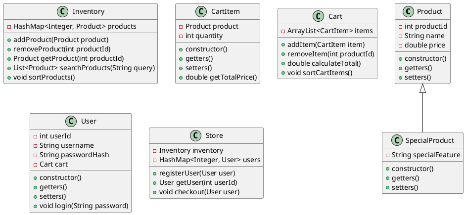

RAW:
https://plantuml.github.io/plantuml-core/raw.html?fLF1JiCm3BtlAt8i0lvWceIG49MOX3JuW91ONKINT8upgD3-dIHDihO33go7g7wsu-SNMxJSMlQCHZf1x6l1_7VBb2RM3LWj4xOXLBfXckyW8TAujnPye183TCs4qPRGfncihXBM016WBROjzd6n4B7-fWEXU9jfm2U1bkUq4WKxH3y09uSNLgxr0RJFwKkHHswtQzujQqtG0Dva5gkiY4stSIcJgyf4KqIkXx0p1yX14r5pICxqLF-CUrAMbeM91OvYcqnR9Lts3h3F2GUZ9BC6gKIDkhxdI3N1hZGzQs0q1dl7DIdg_oNpOASvyM4lXi8h-tcPiobCxX1v7xlD95TC-NEaUW2hqa9mJWMF_XzLJ4m4RuLhEK7aKvr9bk-UQFPg0ISBuZmmtuw0ZJOaePtF_p0emsWbJ-nP-EC2NIFVrZHALxD2uzNoDqBXVHftbVz-6_lGxoesP8kwZNyNmE2feXp1czb4m5EEtfC-4x9Y2-BTE1fd7xy1

png:
https://www.plantuml.com/plantuml/png/fLFHgXGn37tVh-ZZYFe7b-MA80ue25S_eBPXjjXfvoRfwY3-kvrkKwSZ2fUx3ztjEKbpSZQv9zR8QVOdupMH-eJH9iFgvqdbpslb0glbXessOW-CBamgw1agOcFwwY47EdE3NYeJ0p7cj8Z3YufDm0n8xKxj_kjKwpyiO9ps8WD-C0HxbDKaq2tw7MXE-CpAOxX2o3bhA_9Uq-MZNkx6m301lX8LPt64wclQsaeDzLiYf1x27AyWGPsf4bB9JUf_upuuuhkcX42ZkTGh3TMNnmIuIi8rEgieeZpRTVrM8uyCSslwqC1k31wJ3knuVRhDSfSvoM6V8s__iZDmLDEKl47KQ-bMH9wLo-VEzGqSX2raRtZXUnTx9KPxaxncA7g6looJjplFlX1Wjo0f0uVjA5ZRa8OkEVzxHBkDLcLApoOVp_2rwFLnSc4u5Dgl5aS4qRqRToU__Z7sfTzpQOYQkvCZ1joOOJiAAseAa2KNzey_dLXp0VCj9jvbPwNt46oQ_My0

plantUML code:

######