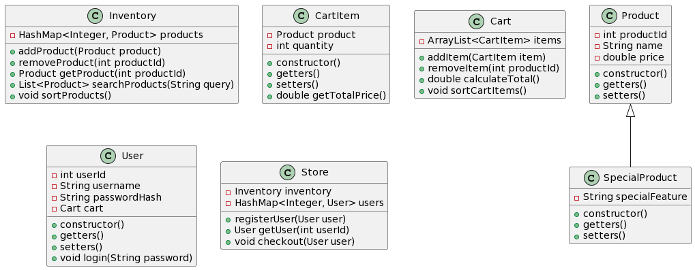

# **Project Proposal: OOP Shopping System**

## **Group Members:**
- **Member 1 Name**
- **Member 2 Name**
- **Member 3 Name**
- **Member 4 Name**

## **Project Overview:**
Our project aims to develop an **Object-Oriented Programming (OOP) based shopping system**. This system will utilize key OOP principles such as inheritance and composition, along with essential data structures like LinkedList and HashMap. We will also implement fundamental algorithms like search and sort.

### Key Components:
1. **Inheritance:**
    - Our design includes a `SpecialProduct` class that **extends** the `Product` class, demonstrating the use of inheritance.
2. **Composition:**
    - The system shows composition through classes like `Cart`, which contains a list of `CartItem` objects, and `Store`, which manages `Inventory` and `Users`.
3. **Data Structures:**
    - **`HashMap`** is used in `Inventory` and `User` classes for efficient data retrieval.
    - **`ArrayList`** (a derivative of LinkedList) is employed in the `Cart` class for dynamic data handling.
4. **Algorithms:**
    - The system will incorporate a **sorting algorithm** to organize products and cart items.
    - A **search algorithm** will be used in the `Inventory` class to find products.

### Development Stages:
1. **Stage 1: Basic Class Setup**
    - Implement basic classes with their attributes and methods.
2. **Stage 2: Integration and Functionality Development**
    - Develop methods for sorting and searching.
    - Implement user interaction flows.
3. **Stage 3: Testing and Refinement**
    - Write tests for each class and method.
    - Refine code for smooth integration.

### Working Code Plan:
- Basic classes implementation with key functionalities by the first draft.
- Iterative development and testing to maintain working code.

### Final Deliverables:
- A fully functioning OOP-based shopping system.
- Complete UML diagram and optional Sequence diagrams.
- Detailed code documentation.

### UML Diagram:
*Insert preliminary UML diagram here, showcasing classes and their relationships*

