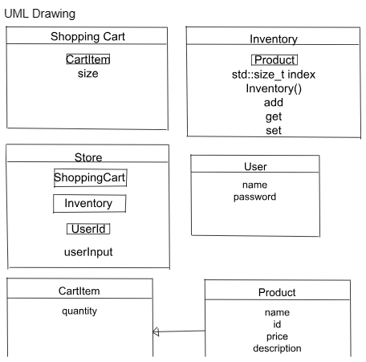
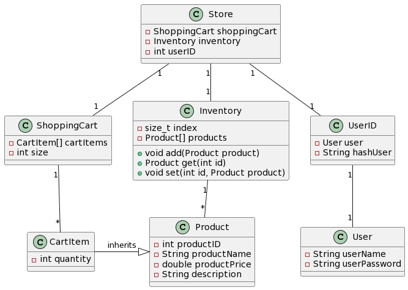

Shopping Cart System Project Proposal

1. Summary of Project Goals
   • To provide users with a simple and efficient online shopping experience.
   • Enable users to browse products, add and remove items from the shopping cart, and proceed to checkout.
   • Utilize a HashMap for fast retrieval of product information.
   • Employ a LinkedList to maintain the order of items in the shopping cart.

2. UML Class Diagram
+ public
  -private
  ------- to separate member and func()

3. Explanation of Guidelines Adherence
   • Data Structures: A LinkedList is used to maintain the order of items within the shopping cart, while a HashMap is employed to manage the inventory of products.
   • Algorithms: Implementation of search functionality in the HashMap for rapid retrieval of product details; using LinkedList traversal to calculate the total cost of the cart.
   • Object-Oriented Design (OOP Design):
   • Inheritance: Special types of products may inherit from a base Product class.
   • Composition: ShoppingCart will compose CartItems, and each CartItem will contain a Product object.

4.Plan of Development Stages
• Stage 1: Design and implement the foundational classes (Product, CartItem, ShoppingCart, Inventory, Store).
• Stage 2: Develop basic functionalities of the HashMap and LinkedList.
• Stage 3: Develop core functionalities of the shopping cart (addition, removal, display, checkout).
• Stage 4: Make file retrieval and creation functions to store the inventory in text files.
• Stage 5: Perform unit testing to ensure all functionalities are working as intended. (Use different files)
• Stage 6: Design the user interface and perform integration testing. (Implement thr Store class.)
• Stage 7: Final project review and deployment.
• Stage 8: (Future Plans) Make a login and sign up screen and have user info stored in the backend so program can remember certain users purchase history.

